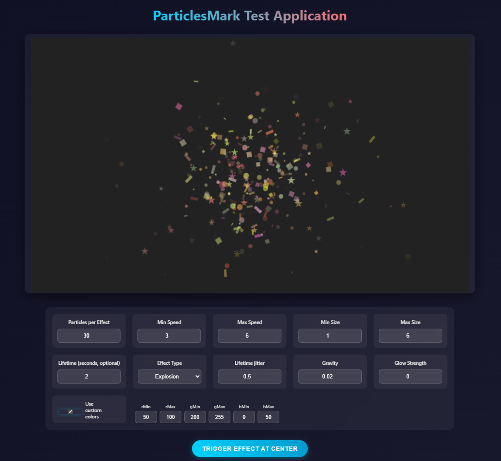

# MarkJSParticles



MarkJSParticles is a lightweight JavaScript library for creating particle effects on HTML5 Canvas. It provides a small, dependency-free API to add particle-based animations (explosions, confetti, fireworks, etc.) to your web pages or apps.

## Features

- Easy class-based API (ES modules)
- Multiple simultaneous effects
- Automatic particle lifecycle management
- Customizable particle and effect properties
- No external dependencies
- Built-in effects: Explosion, Confetti, Fireworks

## Documentation

See the detailed developer documentation for API reference and examples: [markjsparticles.md](./markjsparticles.md)

## Quick Start

1. Include `markjsparticles.js` as an ES module in your page.
2. Create a `<canvas>` element in your HTML and size it.
3. Instantiate `MarkJSParticles` and drive it from your game or render loop.
4. Use `addEffect()` to spawn effects at coordinates.

## Example

```javascript
import { MarkJSParticles } from "./markjsparticles.js";

const canvas = document.getElementById("myCanvas");
const pm = new MarkJSParticles(canvas);

canvas.addEventListener("click", (e) => {
  const rect = canvas.getBoundingClientRect();
  const x = e.clientX - rect.left;
  const y = e.clientY - rect.top;
  pm.addEffect("explosion", [x, y], {
    particlesPerExplosion: 50,
    particlesMinSpeed: 2,
    particlesMaxSpeed: 8,
    particlesMinSize: 1,
    particlesMaxSize: 5,
  });
});
```

Note: the host application is responsible for clearing the canvas before calling `pm.render()` (for example, fill the background each frame). MarkJSParticles only draws particles.

## Configurable Parameters

Common options passed to `addEffect(type, [x, y], options)`:

- `particlesPerExplosion` (Number): Number of particles generated (default varies per effect)
- `particlesMinSpeed`, `particlesMaxSpeed` (Number): Speed range for particle initial velocity
- `particlesMinSize`, `particlesMaxSize` (Number): Size range for particles
- `lifetimeJitter` (Number 0..1): Fractional jitter applied to lifetime (0 = no jitter)
- `lifetimeMs` or `lifetimeMinMs`/`lifetimeMaxMs` (Number): Lifetime in milliseconds when using the JS API. Note: the test UI's "Lifetime" field accepts seconds (the host app converts seconds -> milliseconds before passing to the library).
- `lifetimeJitter` (Number 0..1): Fractional jitter applied to lifetime (0 = no jitter)
- `gravity` (Number): Gravity applied to particles
- Confetti notes: confetti particles may render as `square`, `circle`, `ribbon`, or `star`, but shapes and per-particle motion parameters (for example `sway`, `swayFreq`, `swayPhase`, `angularVelocity`) are generated per-particle internally by the library and are not currently exposed as top-level `addEffect()` options. If you need explicit control over those behaviors, pass custom options (color ranges, sizes, counts) or request API additions.

Visual glow (global): `glowStrength` (Number) — when `glowStrength` > 0, particles are drawn with a subtle canvas shadow to make colors pop. `glowStrength` scales the shadow blur relative to particle size. Default: `glowStrength = 0` (off).
The test app exposes a single numeric input (`glowStrengthNumber`) for precise control — set to `0` to disable glow completely. The default shipped test app starts with `glowStrength = 0`.

## Supported Effects

- `explosion`: particles radiate outward and fall under gravity
- `confetti`: colorful pieces that sway and rotate; shapes include squares, ribbons, circles, and stars
- `fireworks`: upward launch particles that explode at peak into bursts

## Integration with Game Loop

MarkJSParticles expects to be driven by an external loop. Example:

```javascript
let lastTime = performance.now();

function gameLoop(now) {
  const deltaTime = now - lastTime;
  lastTime = now;

  // clear the canvas from the host
  const ctx = canvas.getContext("2d");
  ctx.fillStyle = "#fff";
  ctx.fillRect(0, 0, canvas.width, canvas.height);

  pm.update(deltaTime);
  pm.render();
  requestAnimationFrame(gameLoop);
}

requestAnimationFrame(gameLoop);
```

## Browser Support

Works in modern browsers that support HTML5 Canvas and ES6 modules.

## License

MIT License

## Reverting the Glow Change

If you want to revert the glow behavior entirely, undo the recent changes to `markjsparticles.js` where shadow properties are set during drawing. Alternatively, set `glowStrength` to `0` in the host app's options or the test UI to disable at runtime.
